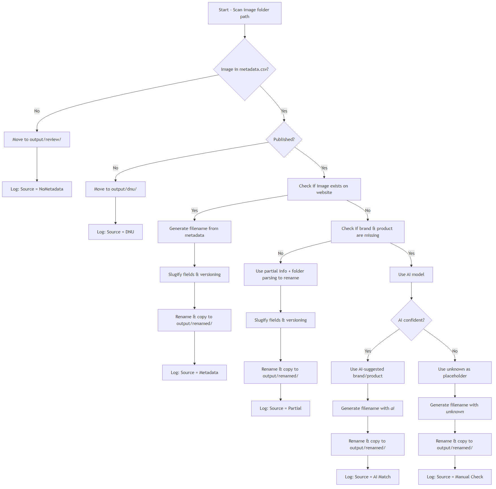

# AI-Powered Image File Naming System v1

## 1. Overview

- This tool is designed to automatically rename image files stored on the company server based on a standardized naming format.
  - **What this tool does**:
     It scans folders containing product images with inconsistent or unclear filenames, and renames them following a standardized format:
     `merchant_brand_productname_variation .jpg`.
     All filenames include a version suffix like _v1.jpg, which is automatically incremented if the file already exists in the output directory (e.g. _v2.jpg, _v3.jpg...).
  - **Why we’re building it**:
     To improve naming consistency across the organization, making images easier to search, manage, and reuse—especially during cross-team collaboration.
  - **Who it’s for**:
     Primarily used by the **Ops** and **Design** teams, especially when referencing image assets for client work, campaign execution, or system uploads.

## 2. Objective

The goal of this project is to build an automated image renaming system that ensures all image files follow a consistent and readable format:

```
merchant_brand_productname_variation.jpg
```

This format makes it easier to organize, search, and reference assets across teams.

Key objectives include:

- **Scan and analyze** image file paths, metadata, and filenames
- **Match merchant, brand, and product name** using existing lookup tables and folder structure
- **Fallback to AI-based suggestions** when brand or product name cannot be identified from existing data
- **Flag uncertain or incomplete results**, clearly marking files as AI-generated or unknown
- **Log all changes** into a centralized `rename_log.csv` for tracking and review
- **Output renamed files** into a clean, standardized folder structure

This tool is intended to reduce manual renaming workload, improve consistency, and prepare assets for smoother handover between Ops, Design, and external systems.

## 3. Features

- Scan image metadata and folder structure
- Match against product table / website content
- AI fallback for missing brand/product
- Rename files and generate rename logs
- Log source (Website / AI / Manual Check)

This tool provides a semi-automated pipeline for organizing and renaming image files stored on the server. Key features include:

- **Standardized Filename Generator**
   Automatically renames images using the format:
   `merchant_brand_productname_variation.jpg`
- **Folder & Metadata Parsing**
   Extracts merchant and product info from folder structure and metadata, reducing reliance on manual input.
- **Brand/Product Matching from Lookup Table**
   Cross-references available product tables to retrieve accurate brand and product names.
- **AI Fallback for Missing Fields**
   When brand or product name cannot be found, the system uses AI models (e.g. BLIP-2 or DeepSeek-VL) to suggest likely values.
- **Uncertainty Handling & Labeling**
   If AI is used or key fields are missing, filenames are clearly marked (e.g. `_ai_` or `_unknown_`) to indicate confidence level.
- **Versioning Logic**
   Automatically detects existing files in the output folder and increments version number (e.g. `_v1`, `_v2`) instead of overwriting.
- **Case & Character Sanitization**
   Converts all names to lowercase, replaces spaces/punctuation with underscores `_`, and removes non-ASCII or special characters to ensure valid filenames.
- **Rename Log Tracking**
   All renaming actions are logged in a `rename_log.csv` file with source attribution (e.g. Website, AI, Manual).
- **Output Folder Management**
   Renamed files are copied or moved to a clean output directory, ensuring no overwrite or file loss.
- **DNU Folder for Irrelevant/Unpublished Items**
   Images not meant for publication (based on metadata flags) are automatically filtered into a separate `DNU/` folder.

## 4. Folder Structure

The project is organized into the following folders:

```bash
fms-folder-taxonomy/
├── images/                     # Original raw images (can be DSM-mounted or locally copied)
│   ├── merchantA/
│   └── merchantB/
│       └── img001.jpg
│
├── data/                       # Data tables and lookup mappings
│   ├── image_metadata.csv      # Includes filename, published flag, merchant_id, etc.
│   ├── product_lookup.csv      # Mapping of merchant_id → brand → product
│   └── merchant_mapping.csv    # Mapping between merchant_id and merchant_name (if needed)
│
├── output/                     # Output directory for processed results
│   ├── renamed/                # Images with standardized filenames
│   ├── dnu/                    # Images marked as “Do Not Use”
│   ├── review/                 # Images without metadata, pending manual check
│   └── rename_log.csv          # Log of all filename changes
│
├── scripts/                    # Core logic modules
│   ├── main.py                 # Main entry point
│   ├── scanner.py              # Scans image file paths
│   ├── matcher.py              # Matches metadata and lookup tables
│   ├── renamer.py              # Handles naming logic and file renaming
│   ├── ai_fallback.py          # AI-based prediction logic (modular)
│   ├── logger.py               # Writes entries to rename_log
│   └── utils.py                # Utility functions (e.g., slugify, version control)
│
├── ai_models/                  # Local AI model scripts or inference logic
│   ├── blip_infer.py
│   └── deepseek_infer.py
│
├── tests/                      # Unit tests (recommended)
│   ├── test_slugify.py
│   ├── test_versioning.py
│   └── test_matcher.py
│
├── assets/                     # Flowcharts, diagrams, README illustrations
│   ├── flowchart.png
│   └── draw.py
│
├── README.md                   # Final project documentation
├── README_v1.md                # Draft or initial version of documentation
├── requirements.txt            # pip dependency list
└── config.yaml                 # Configuration file (paths, AI toggle, thresholds, etc.)
```

### Notes:

- `images/` can be mounted from a DSM server or copied locally
- `output/rename_log.csv` includes old name, new name, and source (Website / AI / Manual)
- AI model files are optional and can be excluded if not using fallback logic

## 5. Input

This tool requires the following inputs:

### A. Image Files

- Located under the `images/` folder (can be a DSM-mounted path)
- Images may be organized by `merchant/brand/product`, or flat and messy
- Supported formats: `.jpg`, `.jpeg`, `.png`

### B. Metadata CSV (`image_metadata.csv`)

A table that includes metadata for each image, exported from Infotech or other internal sources.
 **Required columns:**

| Column Name     | Description                                  |
| --------------- | -------------------------------------------- |
| `filename`      | Original filename                            |
| `merchant_name` | Merchant identifier (folder or code)         |
| `published`     | Whether the image is marked for use (Yes/No) |

### C. Product Lookup Table (`product_lookup.csv`)

Used to match `merchant → brand → product`.
 **Required columns:**

| Column Name     | Description           |
| --------------- | --------------------- |
| `merchant_name` | Merchant code or name |
| `brand_name`    | Brand name            |
| `product_name`  | Product name          |

## 6. Output

### A. Renamed Files

All successfully processed images will be:

- Renamed to the standard format:
   `merchant_brand_productname_variation.jpg`
- (Optional) Copied to:
   `output/renamed/`

### B. Logs

- `rename_log.csv`:
   Records all rename actions, with columns:

| Old Filename | New Filename                    | Source        | AI Used | Notes           |
| ------------ | ------------------------------- | ------------- | ------- | --------------- |
| img123.jpg   | je_hamilton_x1plus_black_v1.jpg | Website Match | No      | —               |
| pic44.png    | elite_unknown_unknown_v1.jpg    | AI Match      | Yes     | brand not found |

- AI-generated names will be marked clearly
- Unknown fields will use `unknown` as placeholder in the filename

### C. DNU (Do Not Use)

Unpublished images will be moved to:
 `output/dnu/`

## 7. Workflow

The image renaming workflow follows a conditional pipeline based on image source and available metadata. Below is a step-by-step outline of the process:

### Step-by-Step Logic

1. **Scan image files from folder path**
    Instead of starting from metadata, the tool begins by scanning all image files in the given directory. It then attempts to match each file with metadata or product table entries.

2. **Check publish status**
    Skip or move any images marked as “DNU” (Do Not Use) to the `output/dnu/` folder.

3. **Check if image exists on the website**

   - If **yes**, try to extract `merchant`, `brand`, and `product name` from metadata or lookup table.
   - If **successful**, generate a standardized filename and log it as **Source: Website**.

4. **If not found on website → fallback to server-only logic**

   Try parsing folder structure to extract known info (e.g. merchant, partial product).

   **Check if both `brand` and `product name` are missing:**

   - If **both missing**, use an **AI model** (e.g. DeepSeek-VL or BLIP-2) to generate name suggestions.
   - The generated filename will include a flag or suffix such as `_ai_` in the log to indicate it was AI-assisted.
   - If AI cannot confidently generate suggestions, mark the filename with `"unknown"` in place of brand/product.

   Log result as:

   - **Source: AI Match** if AI was used
   - **Source: Manual Check** if marked unknown

5. **If AI also fails → log as unknown**

   - Mark as `"unknown"` in filename
   - Log entry as **Source: Manual Check**

6. **Apply file renaming and copy to output**
    All processed files are renamed and copied to `output/renamed/`.

------

### Visual Flowchart



## 8. AI Fallback Logic

To ensure every image file has a usable filename—even when key metadata is missing—we introduce an AI fallback mechanism to assist with incomplete or unknown data.

### When to Trigger AI Prediction

AI name generation is triggered **only when the tool cannot find both `brand` and `product name`** using:

- Website metadata
- Product lookup tables
- Folder path parsing

If **only one** field is missing, the known value will be kept and the missing one will be predicted by AI or labeled as `"unknown"`.

------

### Model(s) Used

- **BLIP-2** (Vision-Language Transformer)
   Generates descriptive captions from image content to infer product or brand name.
- **DeepSeek-VL** (Multimodal LLM)
   Capable of question-answering like:
   *“What product is shown in this image?”* or *“Which brand does this belong to?”*

> These models can be deployed locally (e.g. via Docker) or connected via inference scripts under `ai_models/`.

------

### How "uncertain" vs "unknown" is Marked

| Condition                             | AI Output                         | File Naming                       | Logged As                             |
| ------------------------------------- | --------------------------------- | --------------------------------- | ------------------------------------- |
| Model returns confident prediction    | `Hamilton_X1_Stroller_Black`      | `merchant_hamilton_x1_black.jpg`  | `Source: AI Match`                    |
| Model gives vague/incomplete answer   | Partial or low-probability result | `merchant_ai_product_unknown.jpg` | `Source: AI Match` + `Uncertain` flag |
| Model fails to generate usable result | No meaningful output              | `merchant_unknown_unknown.jpg`    | `Source: Manual Check`                |

In all cases:

- The AI-generated parts are clearly marked in `rename_log.csv`
- Uncertain predictions may be flagged for human verification later
- "Unknown" fields will not be assumed—only used as last resort

## 9. How to Run

### 1. Install dependencies

```bash
pip install -r requirements.txt
```
