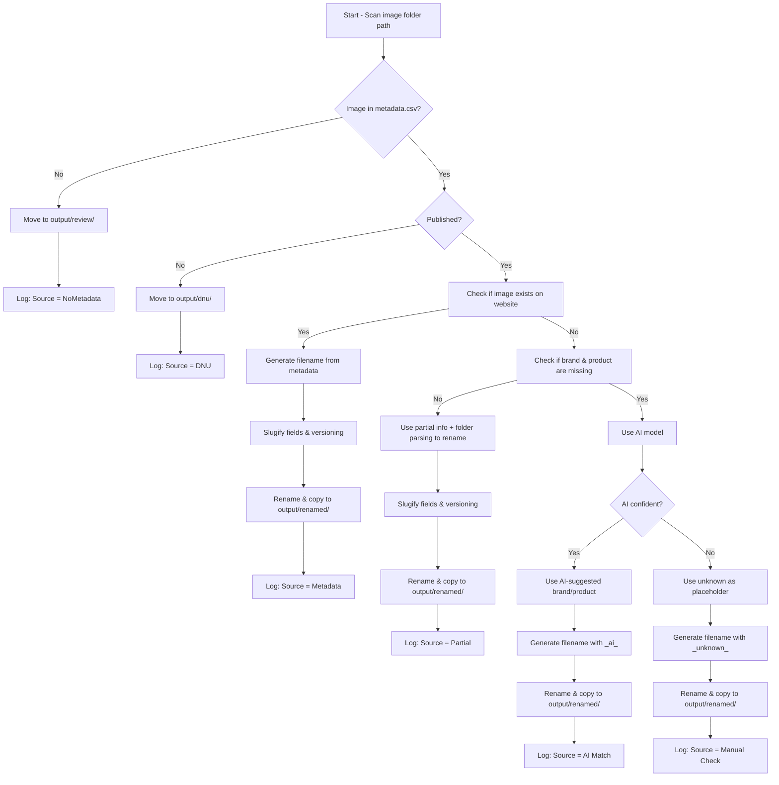

```mermaid

flowchart TD
    A[Start - Scan image folder path] --> B{Image in metadata.csv?}

    B -- No --> C[Move to output/review/<filename>]
    C --> Z1[Log: Source = NoMetadata]

    B -- Yes --> D{Published?}
    D -- No --> E[Move to output/dnu/<filename>]
    E --> Z2[Log: Source = DNU]

    D -- Yes --> F[Check if image exists on website]

    F -- Yes --> G[Generate filename from metadata]
    G --> G1[Slugify fields & versioning]
    G1 --> G2[Rename & copy to output/renamed/]
    G2 --> Z3[Log: Source = Metadata]

    F -- No --> H[Check if brand & product are missing]
    H -- No --> I[Use partial info + folder parsing to rename]
    I --> I1[Slugify fields & versioning]
    I1 --> I2[Rename & copy to output/renamed/]
    I2 --> Z4[Log: Source = Partial]

    H -- Yes --> J[Use AI model]
    J --> K{AI confident?}

    K -- Yes --> L[Use AI-suggested brand/product]
    L --> L1[Generate filename with _ai_]
    L1 --> L2[Rename & copy to output/renamed/]
    L2 --> Z5[Log: Source = AI Match]

    K -- No --> M[Use unknown as placeholder]
    M --> M1[Generate filename with _unknown_]
    M1 --> M2[Rename & copy to output/renamed/]
    M2 --> Z6[Log: Source = Manual Check]

    
```
